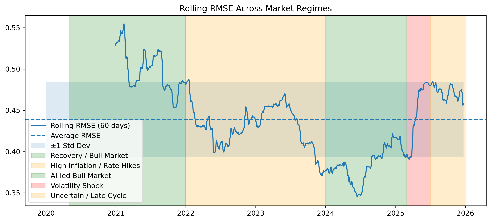
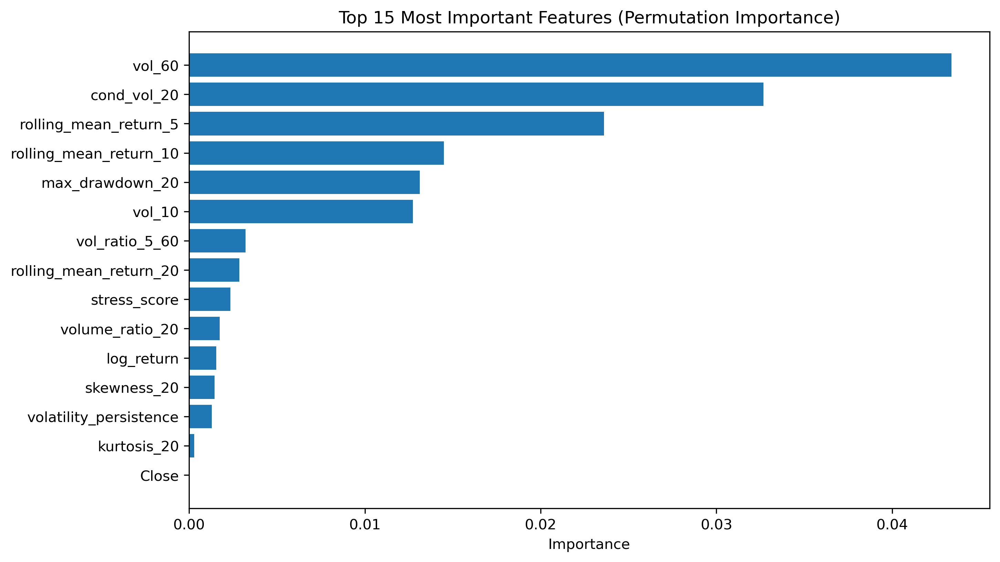
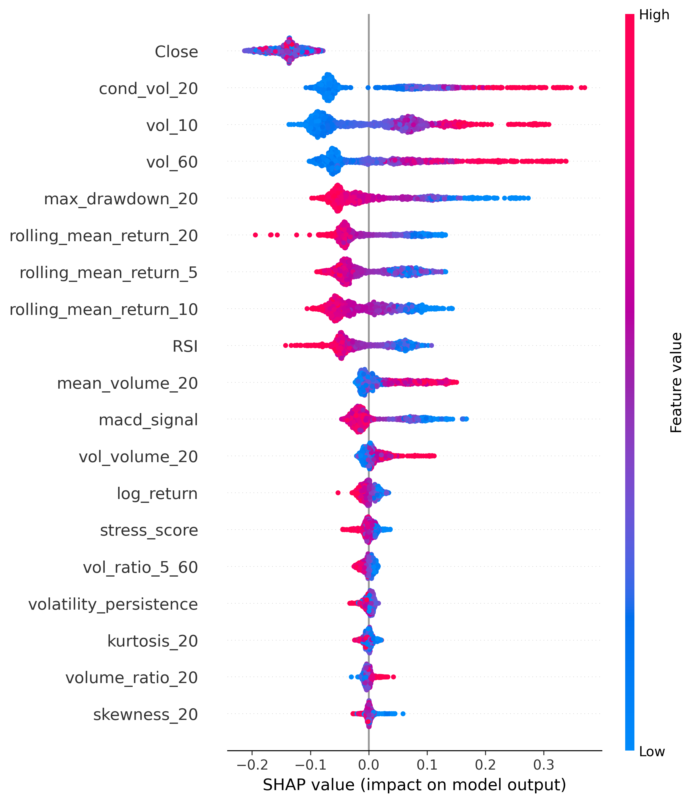
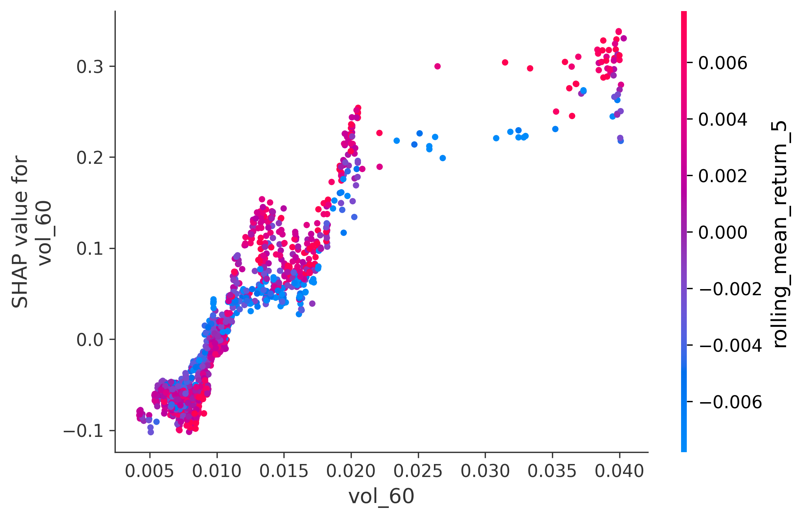

# Volatility Forecasting with Machine Learning

Financial market volatility plays a central role in **risk management, portfolio allocation, and derivative pricing**.  
However, forecasting volatility remains challenging due to **non-linear dynamics, regime shifts, and strong persistence in financial markets**.

This project investigates whether **machine learning models can improve volatility forecasting** compared to traditional linear econometric approaches.

Using a structured time-series modeling pipeline, the project evaluates several models — from linear regressions to tree-based algorithms — and analyzes their ability to capture **volatility dynamics across different market regimes** while maintaining **interpretability and financial relevance**.

---

## Project Objectives

The notebooks aim to address three main questions:

- Can machine learning models **improve volatility prediction** compared to traditional linear models?
- Which financial indicators **drive volatility forecasts**?
- Are machine learning models **robust across different market regimes**, including periods of market stress?

---

## Key Results

- **Best model:** Tuned Random Forest
- **Evaluation metric:** RMSE on volatility prediction
- **Key drivers:** Recent volatility indicators (volatility clustering)
- **Robustness:** Performance remains stable across volatility regimes

### Rolling RMSE



### Feature Importance



### SHAP Summary



### SHAP Dependence Plot

This figure shows how the most important feature influences the model predictions.



---

## Methodology

The analysis follows a structured modeling workflow.

### 1. Data Preparation
- Financial time-series preprocessing
- Feature engineering including:
  - rolling volatility indicators
  - momentum features
  - drawdown and distribution metrics

### 2. Baseline Econometric Models
Traditional models used as benchmarks:

- OLS regression  
- Ridge regression  
- Lasso regression  

### 3. Machine Learning Models

Tree-based models are introduced to capture **non-linear relationships in volatility dynamics**:

- Random Forest  
- Gradient Boosting  

### 4. Hyperparameter Optimization

Models are tuned using **time-series cross-validation** to avoid look-ahead bias and ensure realistic evaluation.

### 5. Model Evaluation

Performance is evaluated using:

- RMSE and MAE metrics
- residual diagnostics
- rolling RMSE stability analysis
- regime-based performance evaluation

### 6. Model Interpretability

To ensure transparency, model predictions are analyzed using:

- Permutation feature importance
- SHAP (SHapley Additive exPlanations)

### 7. Financial Robustness

The financial relevance of the forecasts is assessed through:

- performance across volatility regimes
- risk-based metrics derived from predicted volatility (VaR and Expected Shortfall)

---

## Main Findings

The analysis reveals several key insights:

- The **tuned Random Forest model** achieved the best predictive performance among tested models.
- Volatility forecasts are primarily driven by **recent volatility indicators**, confirming the well-known phenomenon of **volatility clustering**.
- Model performance remains **relatively stable across different market regimes**, although prediction errors increase during periods of extreme market stress.

These results suggest that machine learning models can **capture non-linear volatility dynamics** while remaining consistent with established financial theory.

---

## Project Structure

```
project-root/
├── models/
│ └── saved intermediate datasets
│
├── notebooks/
│ ├── 01_data_preparation_and_EDA.ipynb
│ └── 02_modeling_and_analysis.ipynb
│
├── outputs/
│ ├── rolling_rmse.png
│ ├── feature_importance.png
│ ├── shap_summary.png
│ └── shap_dependence_volatility.png
│
├── requirements.txt
│
└── README.md
```
---

## Technologies Used

- Python  
- pandas  
- NumPy  
- scikit-learn  
- SHAP  
- matplotlib  

---

## Key Concepts Covered

- Time-series machine learning
- Volatility forecasting
- Financial feature engineering
- Model interpretability
- Regime-dependent model evaluation
- Risk metrics in financial markets

---

## Possible Extensions

Future work could explore:

- regime-switching volatility models
- stochastic volatility frameworks
- multi-asset volatility forecasting
- integration of macroeconomic indicators
- higher-frequency financial data

---

## Author

Romain Robles
